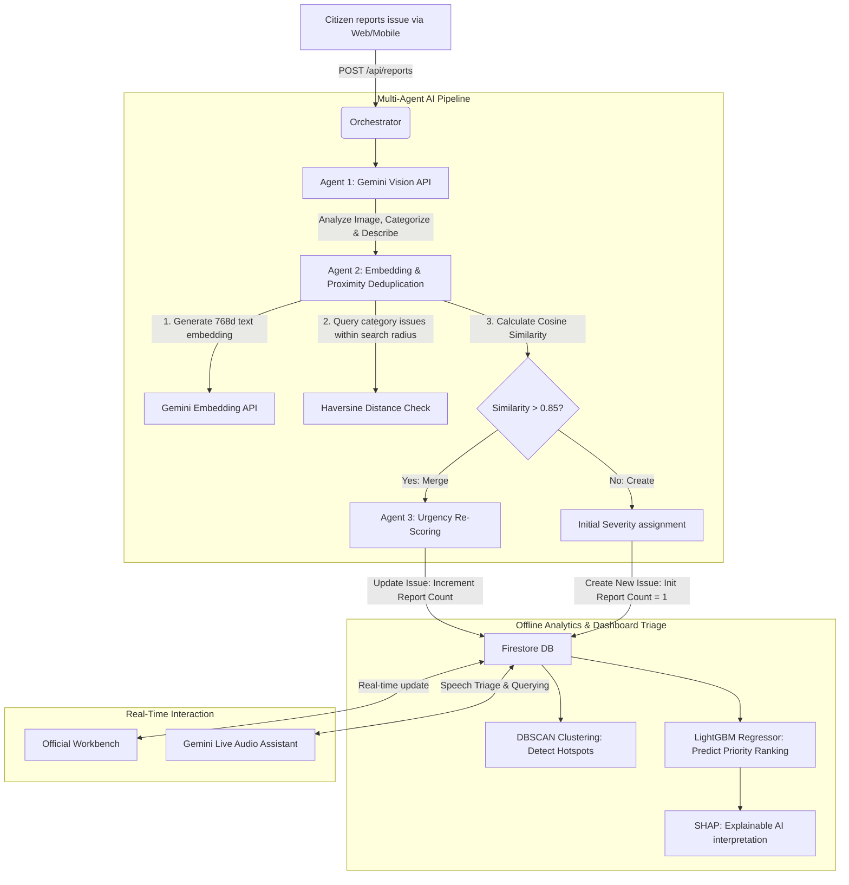

# 🧠 CivicPulse AI: Machine Learning & System Architecture

This document provides a detailed breakdown of the machine learning architecture, multi-agent orchestrations, mathematical formulas, and algorithm implementations powering **CivicPulse AI**. It also references [ml_pipeline_mock.py](file:///d:/vibe2ship/ml_pipeline_mock.py) which contains python source code demonstrations of the algorithms.

---

## 🗺️ System Workflow: High-Level overview

When a citizen uploads a photo of an issue, a sequential pipeline of specialized AI agents runs to validate, deduplicate, prioritize, and record the issue.

---

## ⚡ Machine Learning Implementations

CivicPulse AI uses a hybrid ML architecture combining generative vision models, dense text embeddings, geospatial geometry, tree-based gradient boosting, and explainability frameworks.

### 1. Gemini Vision API: Visual Triage (Classification & Description)
*   **Model**: `gemini-2.5-flash`
*   **Inputs**: Base64 JPEG/PNG image, optional user caption.
*   **Role**: Acts as the visual intake operator.
*   **Output Schema (JSON)**:
    *   `category`: `pothole` | `streetlight` | `garbage` | `water_leakage` | `other`
    *   `confidence`: Float (0.0 to 1.0)
    *   `auto_title`: String (concise, standardized title)
    *   `auto_description`: String (1-2 sentence descriptive summary)
    *   `severity_signal`: Integer (1-5 visual hazard level)
    *   `severity_justification`: String (explanation of the score)

---

### 2. Gemini Embeddings: Semantic Deduplication
To prevent duplicate tickets for the same physical issue (e.g., 20 people reporting the exact same pothole), the system employs a two-tier verification check:

#### Step A: Geospatial Radius (Haversine Distance)
Using the reporter's GPS coordinates, the system calculates the **Haversine Distance** between the new report and all active tickets in the same category.
$$\Delta\sigma = 2 \arcsin\left(\sqrt{\sin^2\left(\frac{\Delta\phi}{2}\right) + \cos(\phi_1)\cos(\phi_2)\sin^2\left(\frac{\Delta\lambda}{2}\right)}\right)$$
$$d = R \cdot \Delta\sigma$$
*Where $\phi$ is latitude, $\lambda$ is longitude, $R$ is Earth's radius (6,371,000m).*

The search radius varies by category to match real-world footprints:
*   **Pothole**: $60\text{ meters}$
*   **Streetlight**: $100\text{ meters}$
*   **Water Leakage**: $80\text{ meters}$
*   **Garbage / Dump Pile**: $150\text{ meters}$

#### Step B: Semantic Cosine Similarity
For any active ticket within the search radius, the system computes the cosine similarity between the dense embeddings of the descriptions.
*   **Embedding Model**: `gemini-embedding-2` (768 dimensions)
$$\text{Cosine Similarity} = \frac{\mathbf{A} \cdot \mathbf{B}}{\|\mathbf{A}\| \|\mathbf{B}\|} = \frac{\sum_{i=1}^{n} A_i B_i}{\sqrt{\sum_{i=1}^{n} A_i^2} \sqrt{\sum_{i=1}^{n} B_i^2}}$$

*   **Heuristic Threshold**: If the similarity is **$> 0.85$**, the agent runs a fast-reasoning merge verification (`gemini-2.5-flash`) comparing both descriptions and the distance to confirm they describe the same event. If confirmed, they are merged.

---

### 3. DBSCAN: Density-Based Spatial Clustering (Hotspot Analysis)
To identify regional issue clusters (e.g., a neighborhood suffering from high concentrations of refuse or broken lighting), an offline batch model clusters the active issues.
*   **Algorithm**: **DBSCAN** (Density-Based Spatial Clustering of Applications with Noise)
*   **Parameters**: `eps` representing maximum radius distance (e.g. 100m) converted to radians, and `min_samples` (minimum reports to form a cluster).
*   **Advantage**: DBSCAN does not require pre-specifying the number of clusters (unlike K-Means) and isolates outliers (noise) that do not belong to high-density zones, allowing city planners to deploy sweeps to dense issue clusters.

---

### 4. LightGBM: Tabular Priority Regression
In addition to the online logarithmic formula, a high-performance **LightGBM (Light Gradient Boosting Machine)** regressor predicts the final priority ranking of issues using both visual, environmental, and temporal features.
*   **Training Features**:
    1. `severity_signal`: Visual hazard level (1-5) from Gemini Vision.
    2. `report_count`: Total duplicate merges/validations.
    3. `distance_to_highway_m`: Calculated distance to closest main transit lanes (m).
    4. `population_density`: Municipal demographic density surrounding GPS coordinate.
    5. `is_peak_hours`: Binary flag indicating if reported during rush traffic.
*   **Why LightGBM?**: Super fast training speed, low memory usage, and high accuracy on tabular data compared to deep learning equivalents.

---

### 5. SHAP (SHapley Additive exPlanations): Explainable AI
To prevent "black-box" decisions and build trust with city officials, the LightGBM priority score is interpreted using **SHAP**.
*   **Algorithm**: **TreeSHAP** (optimized SHAP explainer for decision trees).
*   **Mathematical Concept**: Distributes the difference between the actual predicted priority and the base (average) priority score among the input features, using Shapley values from cooperative game theory:
$$\phi_i(v) = \sum_{S \subseteq N \setminus \{i\}} \frac{|S|!(|N| - |S| - 1)!}{|N|!} (v(S \cup \{i\}) - v(S))$$
*   **Use Case**: For every prioritized ticket, city officials can view a breakdown of features driving that prioritization (e.g., *"+1.5 Priority due to Severity Signal = 5"*, *"-0.3 Priority due to being far from highways"*).

---

## 🎙️ Real-Time WebSocket Audio Assistant
*   **Model**: `gemini-3.1-flash-live-preview` (Multimodal Live API)
*   **Protocol**: WebSockets (`wss://`) running PCM audio streams (16kHz input, 24kHz output).
*   **Role**: Allows citizens and officials to speak naturally with the platform. It can guide citizens on how to report issues, check statuses, and query real-time category statistics.

---

## 📊 Pitch Presentation (PPT) Slide Outline

This outline is designed for a 5-to-10 minute presentation/pitch session for Hackathons or City Councils.

### Slide 1: Title & Vision
*   **Title**: CivicPulse AI — Smart City Operations Orchestrated by Multi-Agent AI
*   **Subtitle**: Streamlining municipal triage and issue resolution in real time.
*   **Visual**: A dark, premium mockup of the dashboard next to a citizen taking a photo of a pothole.
*   **Key Message**: Municipalities spend weeks triaging citizen reports manually. CivicPulse AI automates this from report to resolution in seconds.

### Slide 2: The Problem
*   **Core Points**:
    *   **Triage Overhead**: Local governments are flooded with redundant, misclassified, and low-priority complaints.
    *   **Duplicate Storms**: 50 citizens report the same highway pothole, creating 50 separate tickets.
    *   **Manual Prioritization**: Static lists order tickets by "first come, first served" rather than public risk.

### Slide 3: The Solution — CivicPulse AI
*   **Core Points**:
    *   **30-Second Citizen Intake**: Zero forms. Just snapshot, location, and optional details.
    *   **Orchestrated AI Agents**: A pipeline of specialized LLMs categorizes, locates, clusters, and priority-scores tickets instantly.
    *   **Official Solution Workbench**: Provides actionable AI blueprints and automated crew assignments.

### Slide 4: Multi-Agent Triage Pipeline (Intake & Deduplication)
*   **Visual**: Diagram showing Agent 1 $\rightarrow$ Agent 2 $\rightarrow$ Agent 3.
*   **Bullet Points**:
    *   **Gemini Vision API (Agent 1)**: Evaluates hazard severity and categorizes instantly.
    *   **Geospatial & Semantic Similarity (Agent 2)**: Uses **Haversine Distance** + **Gemini Embeddings** (Cosine Similarity) to automatically merge duplicates.
    *   **Urgency Re-scoring (Agent 3)**: Dynamically adjusts severity upon new duplicate merges.

### Slide 5: Advanced ML Analytics (Hotspots & Priority)
*   **Core Points**:
    *   **DBSCAN Clustering**: Identifies dense geographical issue hot-zones offline for sweep routing, isolating isolated noise.
    *   **LightGBM Regressor**: Predicts ticket priority ranking based on severity, volume, traffic proximity, and population density.
    *   **SHAP (Explainable AI)**: Provides transparent Shapley value attribution for every predicted score so officials know *why* a ticket is prioritized.

### Slide 6: Demonstration — Multimodal Live Audio Assistant
*   **Core Points**:
    *   **Gemini Live Preview**: Hands-free WebSocket voice assistant.
    *   **Citizen Flow**: "Where is my report about the water leak?" $\rightarrow$ "It is currently being fixed by crew 5, Malav!"
    *   **Inclusivity**: Low-literacy or visually impaired citizens can report issues purely by voice.

### Slide 7: Production-Ready & Hardened Architecture
*   **Core Points**:
    *   **Hybrid Cloud Infrastructure**: Deployed on Google Cloud Run containers for WebSocket scalability and Vercel for fast edge rendering.
    *   **Security & Safety**: Base64 signature verification, IP rate-limiting, and Firestore granular access.
    *   **Cost Control**: Dense vector cache layer reducing Firestore read costs.

### Slide 8: Future Roadmap & Impact
*   **Core Points**:
    *   **Roadmap**: Integration with IoT sensors (traffic cameras detecting potholes), public utility APIs, and automated citizen SMS notification loops.
    *   **The Impact**: 80% reduction in city triage labor, 40% faster dispatch times, and increased public safety.
