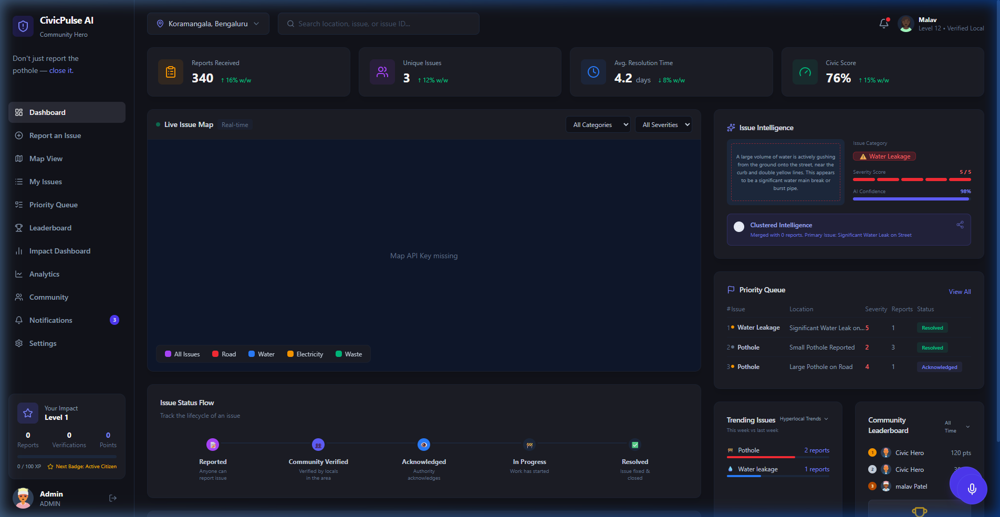
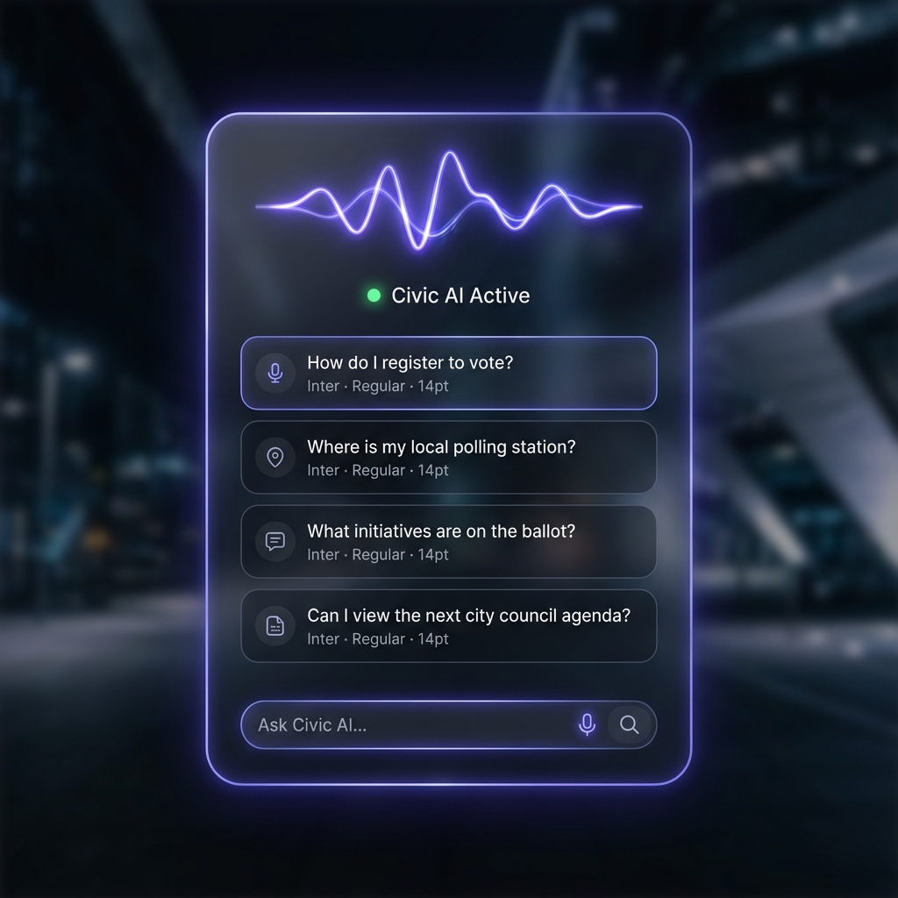
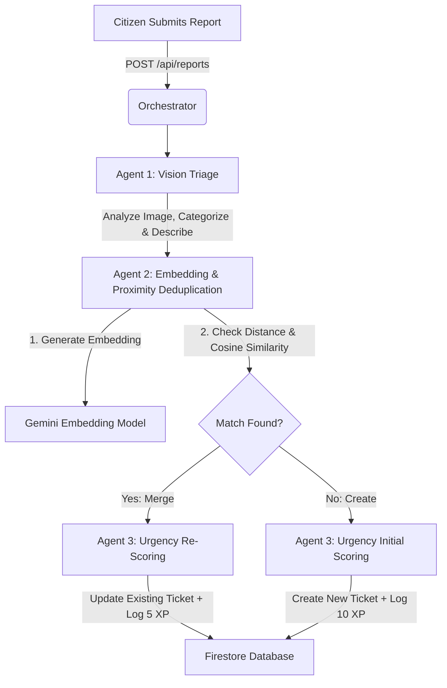

# CivicPulse AI

A state-of-the-art citizen-official collaboration platform powered by **Gemini Multi-Agent Orchestration** and **Real-Time WebSocket Audio Assistance**. 

CivicPulse AI automates the reporting, deduplication, prioritization, and tracking of municipal issues (e.g., potholes, waste disposal, broken streetlights) to reduce municipal triage overhead.

---

## 🎨 Visual Preview

Here is a visual overview of the premium CivicPulse AI dark-themed dashboard and interactive features:

| **City Management Dashboard & Live Map** | **Glassmorphic AI Voice Assistant** |
| :---: | :---: |
|  |  |

---

## 🚀 Key Features

*   **Interactive Triage Map:** Multi-category filtering (Potholes, Water Leaks, waste, lighting) and Severity sorting (High, Medium, Low) that updates map pins and queue tables in real time.
*   **Gemini Live Audio Assistant:** WebSocket voice assistance using `gemini-3.1-flash-live-preview` to handle reports, status checks, and leaderboard XP queries using conversational audio.
*   **Orchestrated Multi-Agent Pipeline:** Multi-step AI processing of incoming citizen photos to auto-generate descriptions, cluster duplicate reports, and rate urgency scores.
*   **Gamified Civic Leadership:** Active Citizen XP system (10 XP per report, 5 XP per verification) tied to a live community leaderboard.
*   **Official Triage & Solution Workbench:** A split-pane dashboard workspace for municipal officials containing a real-time Priority Queue on the left, and an interactive Solution Workbench on the right with automated AI diagnostics, a category-specific Solution Blueprint checklist, official work logging, and status/crew deployment actions.

---

## 🛠️ Multi-Agent Backend Pipeline

When a citizen submits a photo and location, the server orchestrates three specialized agents sequentially:



1.  **Agent 1 (Vision Triage):** Processes the image and user caption using `gemini-3.1-pro` to auto-categorize the issue, generate a clean title, draft a summary, and give a visual severity estimate.
2.  **Agent 2 (Deduplication & Clustering):** Computes text embeddings using `gemini-embedding-2-preview` and queries active Firestore tickets in the same category within a specific radius (e.g., 60m for potholes). If semantic similarity exceeds `0.85`, it runs a fast-reasoning merge confirmation.
3.  **Agent 3 (Severity Triage):** Re-scores the urgency of the issue (1 to 5) based on cumulative report density, visual hazard level, and potential public safety risks, writing the justification to the Firestore transaction.

---

## 🔐 Whitelisted Authority Credentials (Local testing)

To bypass Firebase authentication blocks (such as unauthorized localhost domain errors) during local testing, you can sign in directly using any of the following whitelisted municipal administrator accounts:

| **Official Title** | **Login Email** | **Password** |
| :--- | :--- | :--- |
| **Super Administrator** | `admin@city.gov` | `admin123` |
| **Chief Triage Officer** | `officer.karnan@city.gov` | `officer123` |
| **Pothole Patrol Manager** | `pothole.triage@city.gov` | `pothole123` |
| **Water Inspector** | `water.inspector@city.gov` | `water123` |
| **Waste Management Lead** | `waste.manager@city.gov` | `waste123` |
| **Power & Electricity Board** | `electricity.board@city.gov` | `power123` |
| **Civic Department Head** | `civic.head@city.gov` | `civic123` |
| **Ward 150 Corporator** | `corporator.ward150@city.gov` | `ward150` |
| **Bengaluru Mayor** | `bengaluru.mayor@city.gov` | `mayor123` |
| **Bengaluru Commissioner** | `bengaluru.commissioner@city.gov` | `comm123` |

*Note: Selecting **Log in as Citizen** or **Log in as Admin** on the "Development Bypass Mode" card will automatically sign you in as a mock user.*

---

## ⚡ Production Readiness & Hardening Strategy

For transitioning from a local environment to production, the following security and performance improvements are recommended:

### 1. Rate Limiting (API & WebSockets)
*   **HTTP Endpoints:** Implement IP-based rate limiting on `/api/reports` using Redis and `express-rate-limit` to prevent brute force image submissions:
    ```javascript
    const rateLimit = require('express-rate-limit');
    const RedisStore = require('rate-limit-redis');
    
    const reportLimiter = rateLimit({
      store: new RedisStore({ client: redisClient }),
      windowMs: 15 * 60 * 1000, // 15 minutes
      max: 10, // Limit each IP to 10 reports per window
      message: 'Too many reports submitted from this IP, please try again later.'
    });
    ```
*   **WebSockets:** Implement a token-bucket rate limiter inside the `/api/live` handler to restrict audio packets per connection. Limit maximum concurrent active voice assistant sessions globally and close idle connections after 60 seconds of silence.

### 2. Caching Strategy (Performance & Cost Optimization)
*   **Firestore Query Caching:** Cache global statistics (e.g., active issues, resolution trends) and the leaderboard in Redis with a 5-minute Time-To-Live (TTL). This reduces Firestore read bills dramatically.
*   **Geospatial / Deduplication Caching:** Keep active issue coordinates and their embeddings in a localized cache (e.g., Redis Geospatial index) to compute distance checks faster instead of pulling Firestore documents on every request.

### 3. Scalable Vector Indexing
*   **Vector Database Handoff:** In production, replace in-memory cosine similarity checks with a managed vector database (e.g., Pinecone, pgvector, or Firestore Vector Search). Store embeddings in the vector index and run K-Nearest Neighbor (KNN) queries filtered by category and distance coordinates.

### 4. Firestore Security Rules
Implement secure access rules to ensure database integrity:
```javascript
rules_version = '2';
service cloud.firestore {
  match /databases/{database}/documents {
    // Users can read/write their own records
    match /users/{userId} {
      allow read, write: if request.auth != null && request.auth.uid == userId;
    }
    // Issues can be read by anyone, but only updated by admins or via verified server functions
    match /issues/{issueId} {
      allow read: if request.auth != null;
      allow write: if request.auth != null && get(/databases/$(database)/documents/users/$(request.auth.uid)).data.role == 'admin';
    }
    // Reports can be created by authenticated citizens, but not edited or deleted
    match /reports/{reportId} {
      allow read, create: if request.auth != null;
      allow update, delete: if false;
    }
  }
}
```

### 5. Input Sanitization & File Upload Hardening
*   **MIME Type Validation:** Ensure base64 string uploads are strictly validated on the server for valid magic numbers (signatures) of JPEG/PNG, rather than trusting the client-sent `mimeType` headers.
*   **ClamAV Scanning:** Pass image uploads through an anti-malware scanner (e.g., ClamAV) before sending them to the Gemini API or storing them in Firebase Cloud Storage.

---

## 💻 Running Locally

1.  Clone the repository and install dependencies:
    ```bash
    npm install
    ```
2.  Set up your `.env.local` file:
    ```env
    GEMINI_API_KEY=your_gemini_api_key_here
    VITE_GOOGLE_MAPS_API_KEY=your_google_maps_key_here
    ```
3.  Run the application in development mode:
    ```bash
    npm run dev
    ```
4.  Open the application at **`http://localhost:3000`**.

---

## ☁️ Cloud Deployment Guidelines

CivicPulse AI supports deployment in two primary environments depending on your feature requirements:

### Option 1: Vercel (Serverless Deployments)

Vercel hosts the React frontend statically and deploys backend endpoints (`/api/*`) as Serverless Functions via the included `vercel.json` configuration.

#### Setup Steps:
1. **Import the repository** into your Vercel Dashboard.
2. **Configure Environment Variables** in Vercel settings:
   - `GEMINI_API_KEY`: Your Gemini API key.
   - `VITE_GOOGLE_MAPS_API_KEY`: Your Google Maps JavaScript API Key.
3. **Deploy** the project. Vercel will build both the frontend and backend function automatically.

#### 🔐 Fix Google Authentication Issue (Authorized Domains):
If you get an `auth/unauthorized-domain` error during Google Sign-in on Vercel:
1. Go to the **Firebase Console** -> **Authentication** -> **Settings** tab.
2. Under **Authorized domains**, click **Add domain**.
3. Enter your Vercel deployment domain (e.g., `civicpulse-ai.vercel.app`).
4. Go to **Google Cloud Console** -> **APIs & Services** -> **Credentials**.
5. Select your OAuth 2.0 Client ID (Web Client).
6. Under **Authorized JavaScript origins**, add your Vercel domain URL.

> [!WARNING]
> **WebSocket Live Voice Assistant Limitation:**
> Vercel Serverless Functions do not support persistent connections. Hitting the microphone to trigger the Gemini Live Assistant (`/api/live`) will fail on Vercel serverless. Follow Option 2 below if you need full WebSocket audio assistance.

---

### Option 2: Google Cloud Run (Full Containerized Deployment)

To enable the full experience (including the real-time WebSocket Live Voice Assistant), deploy the project using the containerized `Dockerfile` to a persistent hosting environment like Google Cloud Run.

#### Setup Steps:
1. Ensure the Google Cloud SDK (`gcloud`) is installed and authenticated.
2. Run the deployment command from the project root:
   ```bash
   gcloud run deploy civicpulse-ai \
     --source . \
     --platform managed \
     --allow-unauthenticated \
     --set-env-vars="GEMINI_API_KEY=your_gemini_api_key_here,VITE_GOOGLE_MAPS_API_KEY=your_google_maps_key_here"
   ```
3. Copy the returned Service URL (e.g. `https://civicpulse-ai-xxxxxx.a.run.app`).
4. Add this Cloud Run URL to your **Firebase Authorized Domains** and **OAuth 2.0 Authorized JavaScript origins** to allow Google Sign-In.

