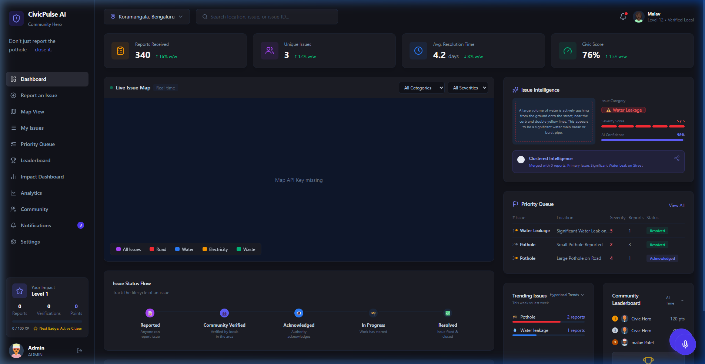
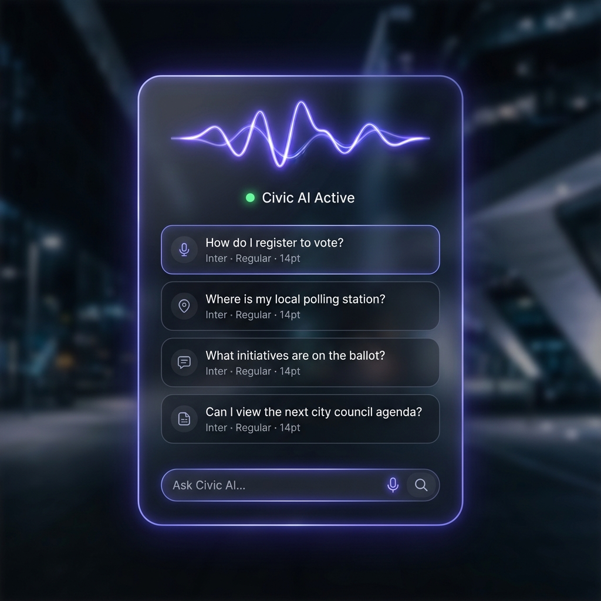
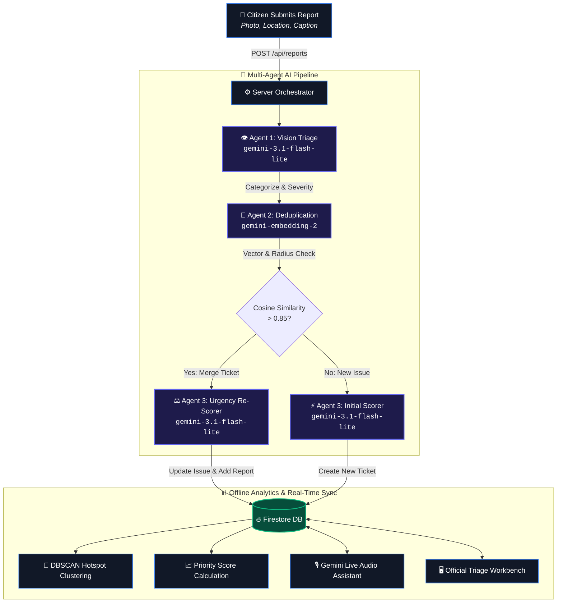

# CivicPulse AI

A state-of-the-art citizen-official collaboration platform powered by **Gemini Multi-Agent Orchestration**, **Computer Vision Triage**, and **Real-Time Voice Assistance**. 

CivicPulse AI automates the reporting, deduplication, prioritization, and tracking of municipal issues (e.g., potholes, waste disposal, broken streetlights) to reduce municipal triage overhead and accelerate city resolutions.

---

### 📖 Technical Documentation & Architecture
* **[Machine Learning & System Architecture](file:///d:/vibe2ship/ML_ARCHITECTURE.md):** Deep dive into the multi-agent AI pipeline, embedding-based deduplication algorithms, geospatial radius checks, dynamic priority formulas, and slide presentation outline.

---

## 🎨 Visual Preview

| **City Management Dashboard & Live Map** | **Glassmorphic AI Voice Assistant** |
| :---: | :---: |
|  |  |

---

## 🚀 Key Features

* **Interactive Triage Map:** Multi-category filtering (Potholes, Water Leaks, Waste, Lighting) and severity sorting (High, Medium, Low) that updates map pins and queue tables in real time.
* **Orchestrated Multi-Agent AI Pipeline:** 3-stage automated intelligence:
  1. **Agent 1 (Vision Triage):** Analyzes photos via `gemini-3.1-flash-lite` for auto-categorization, title generation, and initial hazard detection.
  2. **Agent 2 (Deduplication):** Computes text embeddings using `gemini-embedding-2` and performs geospatial radius checks to merge duplicate tickets.
  3. **Agent 3 (Urgency Scoring):** Scores urgency (1–5) and generates human-readable reasoning based on report density and safety risks.
* **Gemini Live Audio Assistant:** WebSocket voice assistant using `gemini-3.1-flash-live-preview` for conversational reporting, ticket lookups, and leaderboard queries.
* **Gamified Citizen Leadership:** Real-time XP rewarding system (10 XP per report, 5 XP per verification) tied to a live community leaderboard.
* **Official Triage & Solution Workbench:** Dual-pane command dashboard for city administrators featuring real-time Priority Queue management, AI diagnostics, and crew deployment action flows.
* **Production-Grade Authentication:** Real Firebase Auth supporting both Google OAuth and Email/Password for Citizens and City Authorities.

---

## 🛠️ Multi-Agent Backend Pipeline

When a citizen submits a photo and location, the server orchestrates three specialized agents sequentially:


```mermaid
flowchart TD
    A[📱 Citizen Submits Report<br/><i>Photo, Location, Caption</i>] -->|POST /api/reports| B[⚙️ Server Orchestrator]
    
    subgraph Pipeline ["🤖 Multi-Agent AI Pipeline"]
        direction TD
        B --> C[👁️ Agent 1: Vision Triage<br/><code>gemini-3.1-flash-lite</code>]
        C -->|Categorize & Severity| D[🧬 Agent 2: Deduplication<br/><code>gemini-embedding-2</code>]
        
        D -->|Vector & Radius Check| E{Cosine Similarity<br/>> 0.85?}
        
        E -->|Yes: Merge Ticket| F[⚖️ Agent 3: Urgency Re-Scorer<br/><code>gemini-3.1-flash-lite</code>]
        E -->|No: New Issue| G[⚡ Agent 3: Initial Scorer<br/><code>gemini-3.1-flash-lite</code>]
    end

    F -->|Update Issue & Add Report| H[(🔥 Firestore DB)]
    G -->|Create New Ticket| H

    subgraph Analytics ["📊 Offline Analytics & Real-Time Sync"]
        H --> I[📍 DBSCAN Hotspot Clustering]
        H --> J[📈 Priority Score Calculation]
        H <--> K[🎙️ Gemini Live Audio Assistant]
        H <--> L[🖥️ Official Triage Workbench]
    end

    classDef agentStyle fill:#1e1b4b,stroke:#6366f1,stroke-width:2px,color:#fff;
    classDef dbStyle fill:#064e3b,stroke:#10b981,stroke-width:2px,color:#fff;
    classDef mainStyle fill:#111827,stroke:#3b82f6,stroke-width:1.5px,color:#fff;
    
    class C,D,F,G agentStyle;
    class H dbStyle;
    class A,B,I,J,K,L mainStyle;
```

---

## 🔐 Production-Grade Authentication

CivicPulse AI uses a real, secure Firebase Authentication architecture with role-based access control. No mock fallbacks or hardcoded credentials are used.

### 1. Citizen Portal
* **Google Sign-In:** 1-click Google OAuth via `signInWithPopup`.
* **Email & Password:** Full registration and login for citizens, automatically provisioning a Firestore user document with `role: 'citizen'`.

### 2. Municipal Authority Portal
* **Official Access:** Separate portal for city department officials, ward corporators, and triage leads.
* **Role Verification:** Accounts register or authenticate with `role: 'admin'`, granting access to the `/admin` triage workbench and management controls.
* **Server Verification:** Routes are guarded by server-backed Firestore permissions (`users/{uid}.role === 'admin'`).

---

## 💻 Running Locally

The repository is organized as a full-stack project:
* **Frontend:** React 19 + TypeScript + Vite + TailwindCSS (located in [`frontend/`](file:///d:/vibe2ship/frontend))
* **Backend:** Python FastAPI + Google GenAI SDK (located in [`backend/`](file:///d:/vibe2ship/backend))

### Prerequisites
* Node.js v18+ and npm
* Python 3.10+
* Google Gemini API Key

### 1. Backend Setup (FastAPI)
```bash
cd backend

# Create and activate Python virtual environment
python -m venv .venv
# On Windows:
.venv\Scripts\activate
# On Linux/macOS:
# source .venv/bin/activate

# Install dependencies
pip install -r requirements.txt

# Start FastAPI server on port 3000
python -m uvicorn main:app --host 0.0.0.0 --port 3000 --reload
```

### 2. Frontend Setup (React + Vite)
```bash
cd frontend

# Install packages
npm install

# Start Vite dev server on port 5173
npm run dev
```

### 3. Root Workspace Commands
You can also run commands from the project root:
```bash
# Build frontend for production
npm run build

# Start frontend dev server
npm run dev
```

* **Frontend UI:** Open [http://localhost:5173](http://localhost:5173)
* **Backend API:** [http://localhost:3000](http://localhost:3000) (Interactive Swagger Docs at [http://localhost:3000/docs](http://localhost:3000/docs))

---

## ⚙️ Environment Configuration

Set up your `.env` file in the project root:

```env
# Google Gemini API Key (Required for Agent 1, 2, 3 and Live Assistant)
GEMINI_API_KEY="your_gemini_api_key"

# Groq API Key (Optional)
GROQ_API_KEY="your_groq_api_key"

# Google Maps JavaScript API Key (Required for map views)
VITE_GOOGLE_MAPS_API_KEY="your_google_maps_api_key"
```

---

## ☁️ Deployment Guidelines

### Option 1: Vercel (Frontend Web App)

The repository includes a ready-to-use [`vercel.json`](file:///d:/vibe2ship/vercel.json) configured to build and deploy the React frontend:

1. **Import the repository** in your Vercel Dashboard (`kingspy89/vibe2ship`).
2. **Environment Variables:** Set `GEMINI_API_KEY` and `VITE_GOOGLE_MAPS_API_KEY` in Vercel Project Settings.
3. **Deploy:** Vercel automatically runs the build script (`cd frontend && npm install && npm run build`) and publishes `frontend/dist`.

#### 🔐 Authorizing Your Vercel Domain for Google Sign-In:
1. Open the [Firebase Console](https://console.firebase.google.com).
2. Go to **Authentication** → **Settings** → **Authorized domains**.
3. Click **Add domain** and enter your Vercel domain (e.g. `civicplus-ai-git-main-kingspy89s-projects.vercel.app`).
4. Google Sign-In will now work seamlessly on both `localhost` and your Vercel deployment!

---

### Option 2: Google Cloud Run (Full Containerized Deployment)

To deploy both the frontend and persistent backend (including real-time WebSocket audio support):

1. Ensure the Google Cloud SDK (`gcloud`) is installed and authenticated.
2. Deploy directly from the project root:
   ```bash
   gcloud run deploy civicpulse-ai \
     --source . \
     --platform managed \
     --allow-unauthenticated \
     --set-env-vars="GEMINI_API_KEY=your_gemini_api_key,VITE_GOOGLE_MAPS_API_KEY=your_google_maps_key"
   ```
3. Add the Cloud Run Service URL to your **Firebase Authorized Domains**.

---

## 📄 License
This project is licensed under the MIT License.
